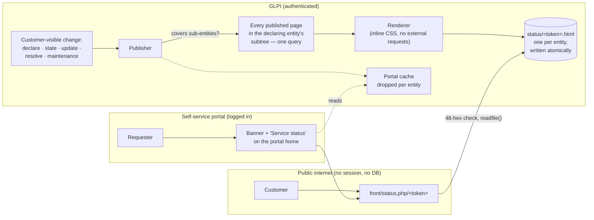

# GLPI Major

Major-incident mode for GLPI 11, and a customer-facing status page.

A customer's file server dies. Twelve people file twelve tickets. Three
technicians answer three of them separately, two of the twelve get no reply at
all, and nobody owns the job of telling the customer what is happening. Four
hours later the thing everyone remembers is not the outage — it is the silence.

**A major incident is a mode, not a priority level.** This plugin gives that
mode a shape: one record, one commander, one comms owner, one customer-visible
title, one update log with an audience on every line, and one published page you
can point the whole customer at instead of answering twelve tickets by hand.

## Why not just set the priority to Very high?

Priority is a queueing hint. It sorts a list. It cannot answer any of the
questions an outage actually raises.

| | Priority = Very high | This plugin |
|---|---|---|
| Says who is commanding | no | yes, and it is a field |
| Says who is telling the customer | no | yes, separately from the commander |
| A title safe to publish | no — the ticket title has hostnames in it | its own field, defaulting to the ticket's |
| Gathers the twelve duplicate tickets | no | offers a one-click attach; never automatic |
| Answers the twelve when it's over | no | proposes a solution on each, pending approval |
| A promise of the next update | no | a field, and a cron that chases it |
| Something the customer can read | no | a static, branded, public status page |
| Somewhere the requester can find it | no | a banner and a standing link on their own portal |
| One outage across a customer's offices | no | one declaration, marked as covering sub-entities |
| A review afterwards | no | a structured one whose timeline is assembled |

GLPI's own "linked tickets" and "child tickets" are the right primitives and
this plugin uses them. What core has no notion of is the *mode*: the state
machine, the two roles, the audience on a message, and the artefact.


## What it does

- **Declaration** — promote any ticket, under a right of its own
  (`plugin_glpimajor_declare`). Roles, state
  (investigating → identified → monitoring → resolved), and a customer-visible
  title that defaults to the ticket's and is meant to be changed.
- **A banner in the record** — at the top of the ticket, not behind a tab. Roles,
  state, affected count, and how overdue the next update is. If **glpi-presence**
  is installed it already shows who is *here*; this shows who holds the *roles*,
  and never duplicates it.
- **Duplicate attachment** — while an incident is open, matching tickets are
  offered *"Possible duplicate of `<title>` — Attach as affected"*. One click
  links it and records who clicked. Matching is category by default, optionally
  location and title wording, always inside a time window, always inside the
  same customer's subtree.
- **One outage across a customer's offices** — a declaration made at a parent
  entity can be marked *"Also covers sub-entities"*. It then appears on every
  sub-entity's status page, their tickets get the duplicate offer, and one
  customer update reaches all of them. It travels **only downwards** — never to
  a sibling, never to a parent. The checkbox is only offered when the entity has
  sub-entities at all.
- **A war-room cockpit** — the incident opens on a header, not a form: the
  customer-visible title, the state as a pill, "Ongoing for 2h 14m" live, a
  four-state progression strip, and the numbers people ask out loud — declared
  when and by whom, **how long the customer waited for the first word**,
  affected tickets, when the next update is due. One prominent button offers
  the natural next transition (skips and regressions in a small menu beside
  it) and drops you into the composer with that state pre-selected. The stock
  GLPI form is one click away behind *Edit details*.
- **An incident feed** — separate from the ticket timeline. One chronological
  story: the declaration, every update with its audience (internal or
  customer-visible), author and the state we believed at the time, and every
  state change ("Moved to Monitoring — from Identified, by whom, when", with
  the outcome on the resolve event). Per-entity templates. A promised
  next-update time, one click to set, and a cron that reminds the comms owner
  — and only them — when it passes. The composer posts all of it in one go:
  "we mitigated it, we're monitoring, next update in 30 minutes" is one Post —
  the note, the state change (a pill row, not a dropdown) and the new promise
  together — not three separate actions.
- **A status page** — per entity, public, at an unguessable address, wearing the
  MSP's branding and using none of GLPI's vocabulary. Current issues with their
  whole update history, planned maintenance, a last-updated stamp with its
  timezone.
- **A public post-mortem** — the finished account of a resolved incident,
  written for the customer and shown **first** in that incident's entry on the
  status page, above the update timeline. Drafted in the war room from the
  moment the incident exists, publishable only once it is resolved, retractable
  at any time. Distinct from the internal post-incident review on purpose — one
  is the house being honest with itself, the other is the same story told
  across the counter. If glpi-ai is available it will draft one from the
  incident's own record; a human edits and publishes, always.
- **A way for requesters to find it** — a calm banner on the self-service portal
  home page while something is happening, naming the customer-visible title and
  linking to their own entity's page, and a standing "Service status" entry in
  the portal menu when nothing is. Read from the plugin's own tables behind a
  short cache; a portal page load never regenerates anything.
- **Resolution that answers people** — every attached ticket receives the outcome
  as a solution **pending approval**. Nothing is closed for anybody.
- **A post-incident review** — required outcome summary to resolve, a structured
  form whose timeline is assembled from the update log and the audit trail,
  actions with owners and dates, and a lock on completion that has a key.

Declaring is a small control on the ticket itself rather than a page of its own
— at the moment somebody decides an outage is a major incident they have already
spent the time they had, and a second screen is a second reason to do it later:


The duplicate offer, on the next person's ticket about the same outage. One
click, and it says what attaching does and does not do:


The cockpit, on a freshly declared incident — the "First customer update:
none yet" chip is the discipline this plugin exists to enforce:


The feed, with the audience on every line and the state changes recorded
between the updates they separate. The internal note names the server and the
vendor; the customer-visible entries are what the customer was told:


## Install

```bash
# from the GLPI root
git clone https://github.com/bijstaan/glpi-major.git plugins/glpimajor
php bin/console plugin:install -u glpi glpimajor
php bin/console plugin:activate glpimajor
```

Settings live at **Setup → Plugins → GLPI Major**. Major incidents and
maintenance windows get their own entries under **Setup**.

Nothing is published until you switch publishing on and generate an address for
an entity. Until then the plugin is entirely internal.

## The status page



The page is **statically rendered**. On every customer-visible change — a
declaration, a state change, a customer-audience update, a resolution, a
maintenance window — the whole document is regenerated and written to
`GLPI_PLUGIN_DOC_DIR/glpimajor/status/<token>.html`. A public endpoint serves
that file.

This is the important part: **the public endpoint does not query the database.**
Not carefully, not with an entity restriction — it does not query it. It checks
that the token in the URL is 48 lowercase hex characters, opens the file of that
name, and sends it. Multi-tenant safety is structural rather than a `WHERE`
clause somebody has to remember, and no request from the internet can reach
anything that knows what a ticket is.

- **Address** — `https://<your glpi>/plugins/glpimajor/front/status.php/<token>`.
  192 bits of randomness. Regenerating retires the old address immediately;
  revoking deletes the file.
- **Branding** — from **glpi-whitelabel** if installed: product name, and the
  login logo (falling back to the main one). The logo is embedded as a `data:`
  URI when it is under the configured ceiling, so the page makes no external
  request at all; over the ceiling it is linked, and the settings page says which
  it did. Without glpi-whitelabel, the page shows a plain wordmark from this
  plugin's own settings.
- **No session** — the path is registered as stateless from
  `plugin_glpimajor_boot()`, which is early enough in GLPI's boot to be believed:
  a customer reading the page is handed no cookie and leaves no session file
  behind. (Registered from `plugin_init_*` instead, as is the obvious place, it
  is too late — GLPI decides whether to start a session before it initialises
  plugins.)
- **Caching** — `Cache-Control: public, max-age=60`, plus `ETag` and
  `Last-Modified`, so a room full of people refreshing during an outage costs one
  read rather than four hundred. This only works because no session is started;
  GLPI's session headers would otherwise mark every response uncacheable. One
  consequence worth knowing: a customer who already has the page keeps it for up
  to a minute after an address is revoked, though the server stops serving it
  immediately.
- **Freshness** — a cron republishes anything stale as a backstop. The status
  card on the settings page reports it.
- **Sub-entities** — an incident or maintenance window marked *"Also covers
  sub-entities"* appears on every page underneath the entity it was declared in,
  and a customer-visible change on it rewrites all of them. The set is found in
  one query over the pages that actually exist, so the cost is proportional to
  addresses somebody minted rather than to branches in the tree, and each page's
  failure is recorded on its own row. It never travels sideways or upwards —
  see *Honest limits*.

The page contains no GLPI vocabulary — no "ticket", no "entity", no
"requester" — and the test suite asserts it, word by word.


## The self-service portal

Requesters had no path to the status page: it existed, it was written on every
customer-visible change, and the only way to it was somebody pasting the URL
into an email. Now the portal carries it.


- **While something is happening** — a banner on the portal home page with the
  customer-visible title, the state in the status page's words, and a link to
  that requester's own entity's page. It also covers planned work that is under
  way or starting within the day.
- **When nothing is** — a standing **Service status** entry in the portal
  navigation, beside Home and FAQ. Shown only when that entity has a live
  address; a link to a page that does not exist is worse than no link.
- **What a requester never sees** — the commander, the comms owner, the ticket's
  own internal title, or an update of any audience. The banner carries the
  customer-visible title and a state label and nothing else.
- **Cost** — one small cached array per entity, read from this plugin's own
  tables. Publishing drops the cache for every entity whose page it rewrote, so
  an update posted at 09:14 is on the portal at 09:14; the sixty-second TTL is
  only a backstop. A portal page load never regenerates a status page.
- **Technicians see none of it.** They have the incident, its banner on the
  ticket, and the list under Setup; a softer copy on the central home page would
  be noise.

Both surfaces are switched on by default and both do nothing at all until
publishing is on and the entity has an address. Either can be switched off
independently in the settings.

The mechanism, for anyone maintaining this against a future GLPI: the banner is
`Hooks::DISPLAY_CENTRAL`, which is the only plugin hook GLPI 11's helpdesk home
page calls — from inside `<table class="central">`, which is why the callback
emits a table row. The link is `Hooks::REDEFINE_MENUS`, which runs inside
`Html::helpHeader()` and takes a flat top-level entry, rather than
`helpdesk_menu_entry`, which still works but buries the entry two clicks deep
under a "Plugins" heading.

## One outage, several offices

A customer with branches has an entity each. When the document server dies,
both offices lose the shared drive — one outage, not two.

Ticking **Also covers sub-entities** on the declaration makes it one:

- every sub-entity's status page carries it, with the same customer updates
- their tickets are offered the same one-click attach, and carry the
  major-incident banner once attached
- a requester in any of them sees it on their portal
- one customer update rewrites every published page underneath


It travels **strictly downwards**. Not to a sibling entity, not to a sibling
office, not to the parent. That is not a filter applied afterwards — every query
walks sons down from the declaring entity or ancestors up from the reading
entity, and a sibling is in neither list, so there is no input that produces
one. Both suites assert it from both directions.

The checkbox appears only when the entity being declared in has sub-entities,
and it is **off** by default: putting an outage on a page is a publication, and
ticking a box costs a click while taking an outage back off three customers'
pages costs an explanation. If your customers are all multi-site, flip the
default in the settings.

Resolution is unchanged: the outcome is proposed onto **attached** tickets only.
Attaching is a decision somebody made about a specific ticket; proposing a
solution onto every open ticket in three offices because they happen to be
underneath the incident is auto-touching customers, which this plugin does not
do anywhere.

## The optional AI review

If **glpi-ai** is installed, a provider is configured, and the entity is
permitted in glpi-ai's own settings, the composer offers **Review before
publishing** on a customer-audience update. The model reports three things:
jargon a customer would not follow, detail that should not leave the estate
(hostnames, vendors, names, addresses, speculation stated as fact), and whether
the update fails to say what happens next.

**The model never writes an update and never rewrites one.** It reads a draft
and reports. Whether a review was requested, and whether the wording changed
afterwards, are both recorded against the published update.

Under the same guards — and the same single switch — the post-mortem panel
offers **Draft with AI**: a first draft of the customer-facing post-mortem,
built from the incident's own record (the state timeline, the update log, the
outcome, and the internal review's answers where filled), pinned to plain
customer-safe prose with nothing internal in it. The draft lands **in the
textarea** for a human to edit; publishing is always a human act, and a
published text that originated as a draft says so permanently (`ai_drafted`,
shown in the panel and in the audit trail — the same honesty the update log
keeps with `ai_reviewed`).

Off by default. Text is sent to whichever provider glpi-ai is configured with,
and nothing is sent when it is off. When any guard fails, both buttons degrade
the same way: absent, with the reason written down where the button would be.

## Settings

| Setting | Default | Notes |
|---|---|---|
| Publish status pages | off | Master switch; off, no file is written |
| Page title | empty | Falls back to the branding plugin's product name |
| Timezone | GLPI's | Printed next to the "last updated" stamp |
| Support email / telephone | empty | Shown in the page footer |
| Keep resolved incidents for | 30 days | How far back the history goes |
| Embed the logo under | 256 KB | Over that it is linked instead |
| Republish anything older than | 60 min | The cron backstop, not the normal path |
| Tick "Also covers sub-entities" by default | off | Only ever offered when the entity has sub-entities |
| Banner on the portal home page | on | Inert until publishing is on and the entity has an address |
| Quiet "Service status" link in the portal | on | Shown whenever that entity has a live address |
| Offer the duplicate banner | on | |
| Match on category / location / wording | on / off / off | At least one stays on |
| Only offer incidents declared within | 72 h | |
| Shortest word that counts as similar | 5 | Without a floor, "the" matches everything |
| Remind the comms owner | on | GLPI notification, to them alone |
| Grace period | 5 min | Nothing is late the instant it is due |
| Remind again after | 30 min | A reminder every cron run gets muted |
| Default next-update interval | 60 min | What the one-click button offers |
| AI review of customer updates | off | Requires glpi-ai and its entity gate |
| Require an outcome summary to resolve | on | It is also what affected tickets receive |
| Lock a review when complete | on | The lock has a key; unlocking is recorded |
| Attach this procedure on resolution | none | Requires glpi-sop |
| Offer actions to the improvement register | off | Requires glpi-improve |
| Keep the audit trail for | 730 days | |


## Rights

- `plugin_glpimajor_declare` — the incident itself. On install, full rights go to
  profiles that already hold core `config` UPDATE, and **read** to every profile
  that can read a ticket. Declaring is deliberate; *seeing* that a declaration
  exists has to be universal, or the banner is invisible to the people it is for.
  Widen it in **Administration → Profiles** if your service desk should be able
  to declare.
- `plugin_glpimajor_config` — settings, templates, status-page addresses,
  maintenance windows. All standard rights rather than read-and-update: a
  maintenance window is an itemtype keyed on this right, and GLPI gates an
  itemtype's *new-item form* on CREATE — without it the Add button in the menu
  leads to a blank page.

## Integration seams

Every one of these is optional and guarded. The plugin installs and runs with
none of the others present.

### Maintenance announcements — for other plugins to call

Another plugin (a change-approval workflow, say) can put a maintenance window on
a customer's status page:

```php
$id = \GlpiPlugin\Glpimajor\Maintenance::announce([
    'entities_id'  => 4,                       // required
    'name'         => 'Overnight firewall upgrade',   // required, customer-facing
    'content'      => 'Internet access will drop briefly, twice.',
    'date_start'   => '2026-09-01 22:00:00',
    'date_end'     => '2026-09-02 02:00:00',
    'state'        => 'scheduled',             // scheduled|in_progress|completed|cancelled
    'is_recursive' => 0,                       // 1 = also covers that entity's sub-entities
    'source'       => 'glpichange',            // your plugin key
    'external_key' => 'change:1234',           // your own id for this window
]);
// int on success, false on refusal — Maintenance::lastError() says why.

\GlpiPlugin\Glpimajor\Maintenance::withdraw('glpichange', 'change:1234');
// Marks it cancelled rather than deleting it: a window a customer already
// planned around should visibly go away.
```

`source` + `external_key` make `announce()` an **upsert**, so a caller re-running
its own sync updates its window rather than littering the customer's page. The
affected entity's page is republished automatically. No session or right is
required, so a cron in another plugin can call it.

`is_recursive` is optional and defaults to `0`, which is exactly what this call
has always meant: the window covers the entity you named. Pass `1` and it also
covers that entity's sub-entities — every one of their status pages carries it,
and all of them are republished. It never travels sideways or upwards. A caller
written before this existed needs no change.

Guard the call if you would rather not hard-depend:

```php
if (class_exists(\GlpiPlugin\Glpimajor\Maintenance::class)) { … }
```

### Post-incident actions → an improvement register

If **glpi-improve** is present and the setting is on, each PIR action offers a
*Send to improvements* button. The contract this plugin calls:

```php
\GlpiPlugin\Glpiimprove\Candidate::fromPlugin(array $payload): int|false
```

with

```php
[
  'source'       => 'glpimajor',
  'source_key'   => 'piraction:<id>',   // stable, so a re-push is idempotent
  'entities_id'  => int,
  'title'        => string,             // the action, one line
  'description'  => string,             // incident title, what happened, impact, root cause
  'users_id'     => int,                // proposed owner, 0 if none
  'due_date'     => string|null,        // 'Y-m-d'
  'itemtype'     => 'GlpiPlugin\Glpimajor\Incident',
  'items_id'     => int,                // the incident it came from
]
```

Return the candidate's id and it is recorded against the action, which stops the
same action being offered twice. Return `false` and it is taken as "not
accepted", not as an error. The call is guarded with `class_exists` and
`method_exists`, so nothing here depends on that plugin ever existing.

A completed review, locked. The timeline under it is assembled from the update
log and the audit trail rather than typed, and the agreed action has already
been sent to the improvement register:


### glpi-sop

Configure a post-incident-review procedure and it is attached to the incident's
ticket when the incident resolves. If the procedure has been deleted, that is
recorded as an event and the resolution carries on.

### glpi-whitelabel

Read-only, for the status page's branding. Nothing here ever writes to it.

## Honest limits

- **One brand, not one per customer.** glpi-whitelabel is instance-wide, so every
  status page wears the MSP's identity. Per-entity you get a page title, a
  support note and the support contact, and nothing else.
- **The status page is English.** Its strings are not translated: it is one
  document served to whoever holds the address, and there is no session to read
  a language preference from. The technician-facing side is fully translatable.
- **Regeneration is synchronous.** Publishing an update writes a file on that
  request. It is a few kilobytes and it means the technician who pressed the
  button knows it worked, but it is not free. A failure is recorded on the page
  row and shown on the settings page rather than thrown at the technician.
- **`affected_count` is a cache.** The `affected` rows are the truth; the column
  exists so the incident list can sort on it, and it is recomputed on every
  attach and detach.
- **Coverage is downwards only, and there is no way to ask for anything else.**
  A branch's outage never reaches its head office's page, and no entity ever
  sees a sibling's. If two customers share a real dependency — the same
  hosting, the same line — that is two declarations, deliberately.
- **Republishing a covering change costs one render per published page in the
  subtree, on the request that made the change.** Three offices is three small
  files and nobody notices. A customer with forty sub-entities that have *all*
  been given addresses is forty renders on the request that posted the update,
  and that would be felt. The query only finds pages that exist, so the cost
  tracks addresses somebody minted rather than branches in the tree — but if you
  publish for a deep estate, mint addresses where customers actually read them.
  A failure on one page is recorded on that page's row and does not stop the
  others.
- **The portal reads a cache.** Sixty seconds, per entity, dropped whenever that
  entity's page is republished. Anything that changes what the banner should say
  *without* republishing a page — switching the surfacing off in the settings,
  or a row edited straight in the database — can therefore be up to a minute
  late there. The published page itself is never stale: it is written
  synchronously on the request that changed it.
- **The portal banner says "ticket".** The status page uses none of GLPI's
  vocabulary and the suite scans it word by word; the portal is inside GLPI's
  own helpdesk, whose navigation says "Tickets" two inches above the banner, so
  "your ticket is still with us" is the customer's own word for it there. Roles,
  internal notes and the ticket's own title are still absent, and asserted so.
- **No detection.** Nothing here declares an incident by itself, and nothing
  attaches a ticket by itself. Both are always a person.
- **The duplicate link is `SON_OF`, not `DUPLICATE_WITH`.** Core treats a
  duplicate link as an instruction — solving the parent copies the solution into
  every duplicate *and* pushes a status change onto them. That is auto-closing by
  another name. `SON_OF` carries no propagation, so the relationship is recorded
  and the decision stays ours.
- **Detaching leaves the core link.** Somebody may have explained it in a
  followup, and silently unpicking a relationship a technician can see is worse
  than leaving a stale one they can remove.
- **Audit rows outlive their incident.** Purging an incident drops its updates,
  attachments and review, but not its audit trail — "who deleted the record of
  the outage" is exactly the question an audit trail exists to answer.

## Licence

GNU General Public License, version 3 or later — the same licence as GLPI.
This plugin is loaded into GLPI's process and extends its classes, so it is a
derivative work of GLPI and carries GLPI's licence. See [LICENSE](LICENSE).
