# GLPI Major

Major-incident mode for GLPI 11, and a customer-facing status page.

A major incident is a mode, not a priority level. This plugin gives it a shape:
one record, one commander, one comms owner, one customer-visible title, one
update log with an audience on every line, and one published page you can point
a whole customer at instead of answering twelve tickets by hand.

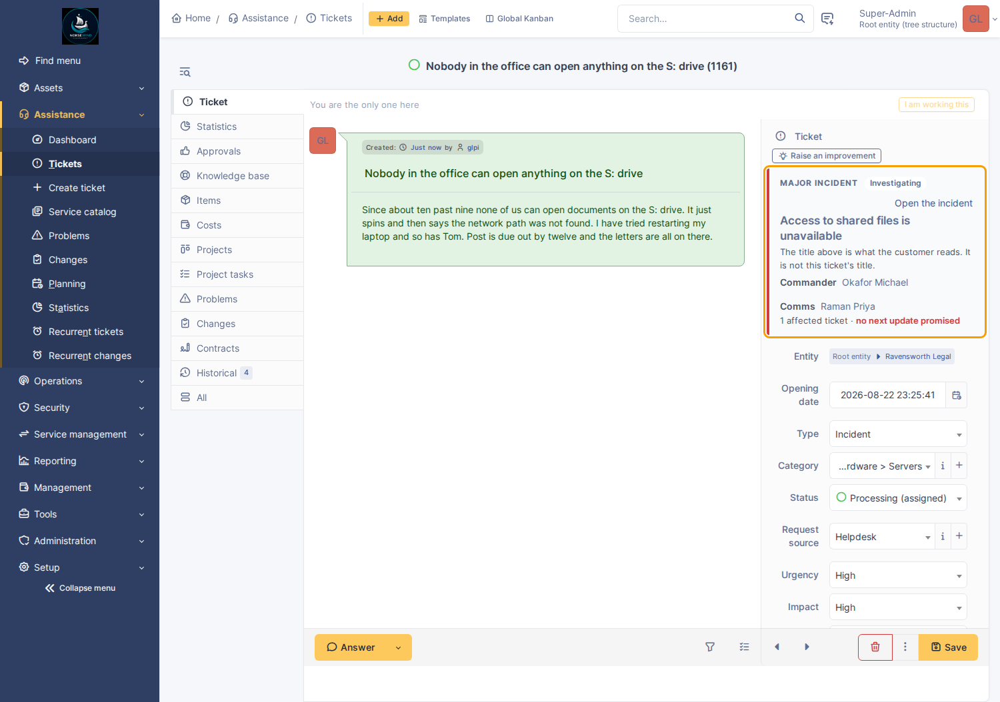

## Compared to setting priority to Very high

| | Priority = Very high | This plugin |
|---|---|---|
| Says who is commanding | no | yes, and it is a field |
| Says who is telling the customer | no | yes, separately from the commander |
| A title safe to publish | no — the ticket title has hostnames in it | its own field, defaulting to the ticket's |
| Gathers the duplicate tickets | no | offers a one-click attach; never automatic |
| Answers them when it is over | no | proposes a solution on each, pending approval |
| A promise of the next update | no | a field, and a cron that chases it |
| Something the customer can read | no | a static, branded, public status page |
| Somewhere the requester can find it | no | a banner and a standing link on their own portal |
| One outage across a customer's offices | no | one declaration, marked as covering sub-entities |
| A review afterwards | no | a structured one whose timeline is assembled |

GLPI's linked and child tickets are the right primitives and this plugin uses
them. What core has no notion of is the mode: the state machine, the two roles,
the audience on a message, and the artefact.

## Features

- **Declaration** — promote any ticket, under a right of its own
  (`plugin_glpimajor_declare`). Roles, state (investigating → identified →
  monitoring → resolved), and a customer-visible title defaulting to the
  ticket's.
- **A banner in the record**, at the top of the ticket rather than behind a tab:
  roles, state, affected count, how overdue the next update is. Where
  `glpipresence` is installed it already shows who is *here*; this shows who
  holds the *roles*, and never duplicates it.
- **Duplicate attachment** — while an incident is open, matching tickets are
  offered *"Possible duplicate of `<title>` — Attach as affected"*. One click
  links it and records who clicked. Matching is category by default, optionally
  location and title wording, always inside a time window and the same customer's
  subtree.
- **One outage across a customer's offices** — a declaration at a parent entity
  can be marked *Also covers sub-entities*. It then appears on every sub-entity's
  status page, their tickets get the duplicate offer, and one customer update
  reaches all of them. It travels only downwards.
- **A war-room cockpit** — the incident opens on a header rather than a form: the
  customer-visible title, the state as a pill, "Ongoing for 2h 14m" live, a
  four-state progression strip, and the numbers people ask out loud — declared
  when and by whom, how long the customer waited for the first word, affected
  tickets, when the next update is due. One prominent button offers the natural
  next transition and drops you into the composer with that state pre-selected.
- **An incident feed**, separate from the ticket timeline: the declaration, every
  update with its audience, author and the state believed at the time, and every
  state change. Per-entity templates. A promised next-update time, one click to
  set, and a cron that reminds the comms owner and only them. The composer posts
  the note, the state change and the new promise in one go.
- **A status page** per entity: public, at an unguessable address, wearing the
  MSP's branding and using none of GLPI's vocabulary.
- **A public post-mortem** — the finished account of a resolved incident, written
  for the customer and shown first in that incident's entry on the status page.
  Drafted in the war room from the moment the incident exists, publishable only
  once resolved, retractable at any time. Distinct from the internal
  post-incident review.
- **A way for requesters to find it** — a banner on the self-service portal home
  while something is happening, and a standing *Service status* entry when
  nothing is.
- **Resolution that answers people** — every attached ticket receives the outcome
  as a solution *pending approval*. Nothing is closed for anybody.
- **A post-incident review** — required outcome summary to resolve, a structured
  form whose timeline is assembled from the update log and audit trail, actions
  with owners and dates, and a lock on completion that has a key.

Declaring is a small control on the ticket itself rather than a page of its own:
at the moment somebody decides an outage is a major incident they have already
spent the time they had.

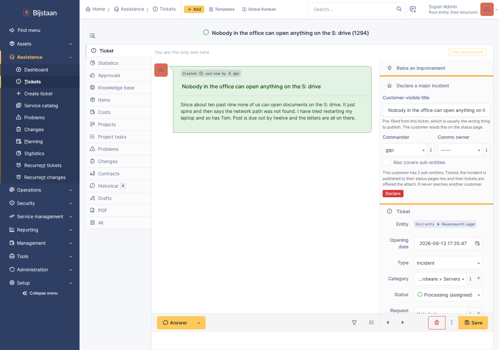

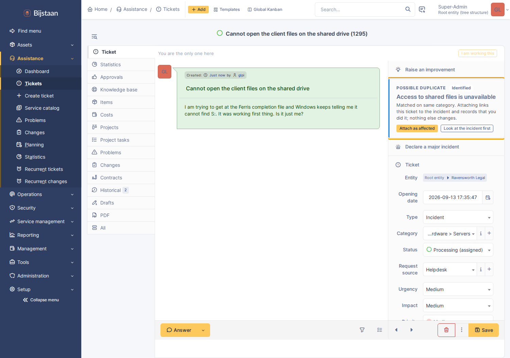

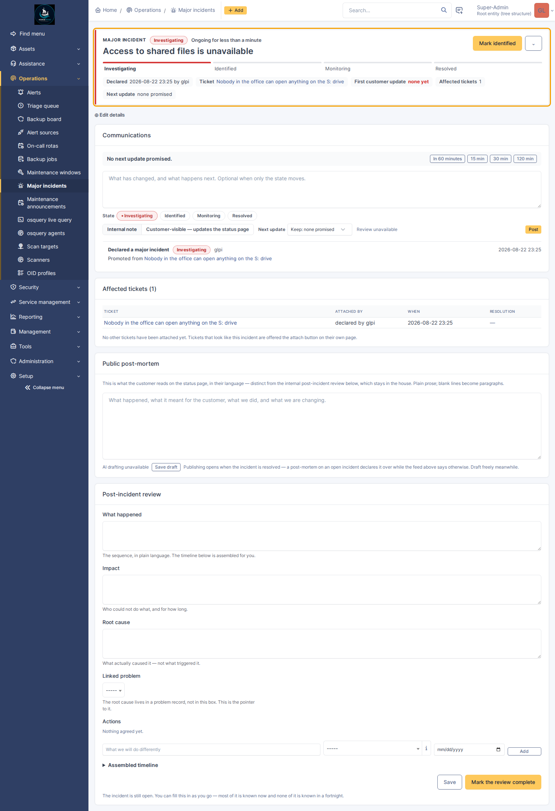

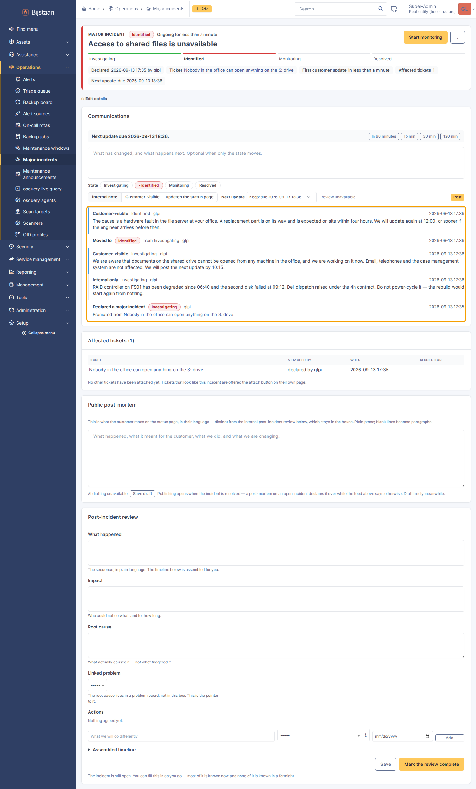

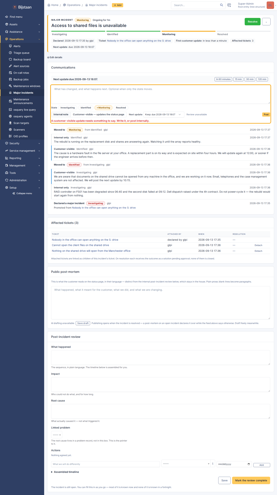

## Install

```bash
# from the GLPI root
git clone https://github.com/bijstaan/glpi-major.git plugins/glpimajor
php bin/console plugin:install -u glpi glpimajor
php bin/console plugin:activate glpimajor
```

Settings at **Setup → Plugins → GLPI Major**. Major incidents and maintenance
windows get their own entries under **Setup**.

Nothing is published until you switch publishing on and generate an address for
an entity. Until then the plugin is entirely internal.

## The status page

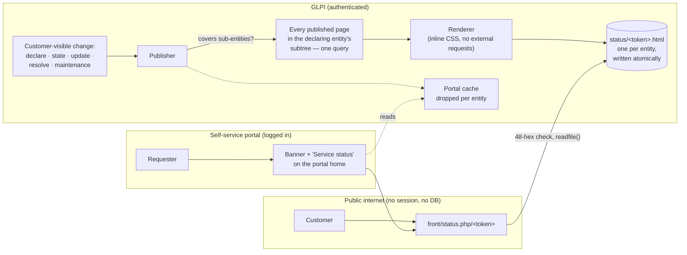

The page is statically rendered. On every customer-visible change the whole
document is regenerated and written to
`GLPI_PLUGIN_DOC_DIR/glpimajor/status/<token>.html`, and a public endpoint serves
that file.

**The public endpoint does not query the database.** Not carefully, not with an
entity restriction — it does not query it. It checks the token is 48 lowercase
hex characters, opens the file of that name, and sends it. Multi-tenant safety is
structural rather than a `WHERE` clause somebody has to remember, and no request
from the internet reaches anything that knows what a ticket is.

- **Address** — `https://<your glpi>/plugins/glpimajor/front/status.php/<token>`,
  192 bits of randomness. Regenerating retires the old address immediately;
  revoking deletes the file.
- **Branding** — from `glpiwhitelabel` if installed: product name, and the login
  logo falling back to the main one. The logo is embedded as a `data:` URI under
  the configured ceiling so the page makes no external request; over it, linked,
  and the settings page says which it did. Without glpiwhitelabel the page shows
  a plain wordmark from this plugin's own settings.
- **Look** — built from GLPI 11's own visual vocabulary: Tabler cards, badges,
  alerts, list groups and status dots with the same tokens the interface uses, so
  a customer who has seen the portal recognises it. It cannot link GLPI's
  stylesheet — the page is a flat file served without a session, and a `<link>`
  to the instance would defeat both the no-external-request property and the
  caching — so the CSS is a small hand-written subset of Tabler carrying real
  token values, inline. It is the stock palette rather than the running
  instance's, since the file is generated once and read by people who never log
  in. It follows `prefers-color-scheme`, and every theme-varying colour is a
  custom property redefined in the dark block.
- **No session** — the path is registered as stateless from
  `plugin_glpimajor_boot()`, which is early enough in GLPI's boot to be believed.
  Registered from `plugin_init_*`, the obvious place, it is too late: GLPI
  decides whether to start a session before it initialises plugins.
- **Caching** — `Cache-Control: public, max-age=60`, plus `ETag` and
  `Last-Modified`, so a room full of people refreshing during an outage costs one
  read rather than four hundred. This only works because no session is started.
  One consequence: a customer who already has the page keeps it for up to a
  minute after an address is revoked, though the server stops serving it
  immediately.
- **Freshness** — a cron republishes anything stale as a backstop, reported on the
  settings page's status card.

The page contains no GLPI vocabulary — no "ticket", no "entity", no "requester"
— and the test suite asserts it word by word.

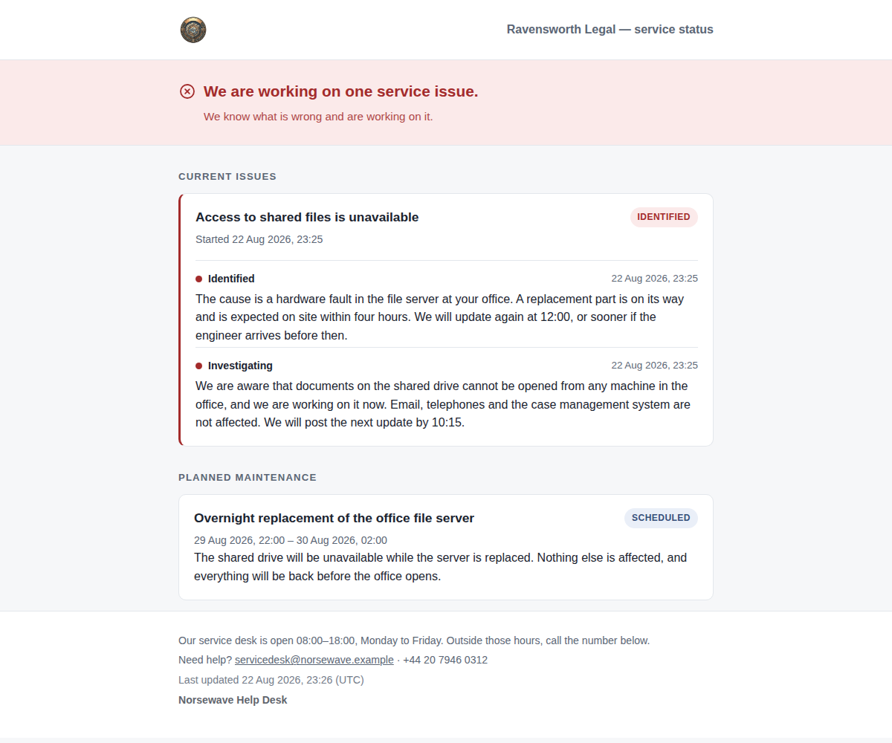

## The self-service portal

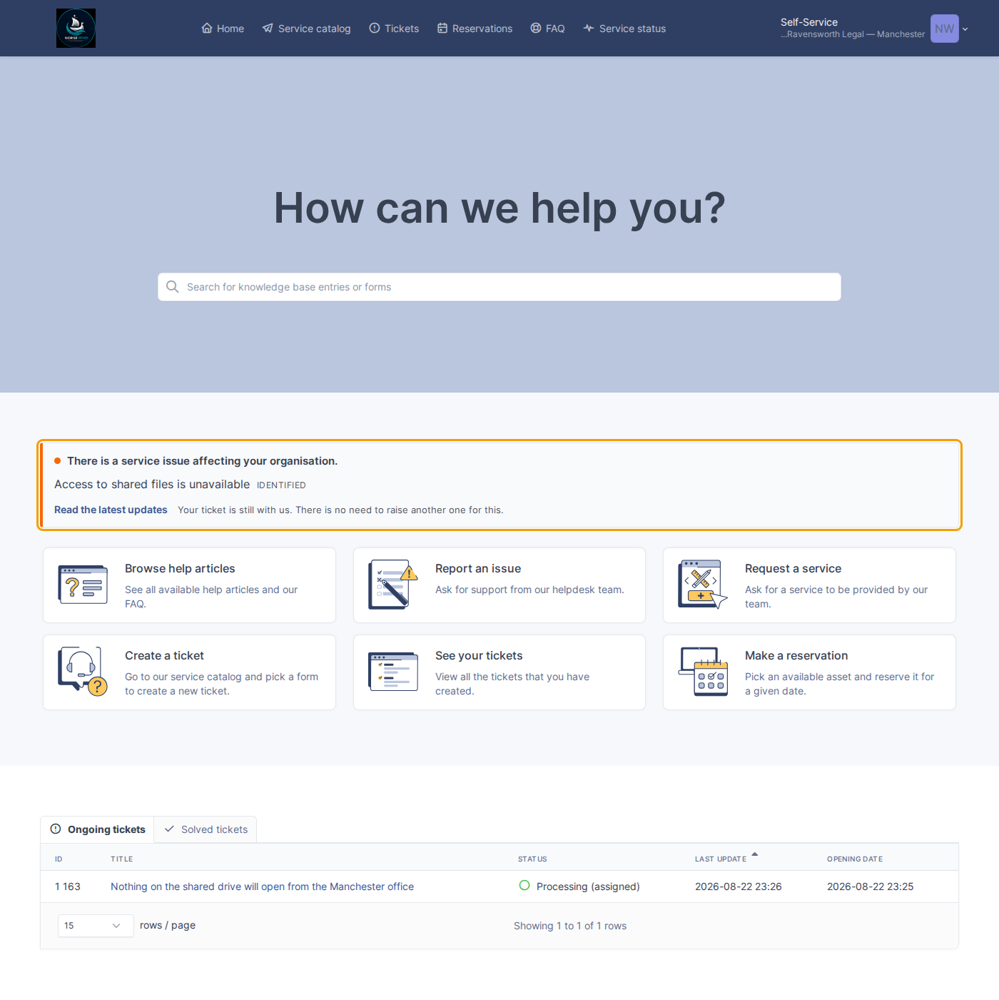

- **A status page inside the portal** — a signed-in requester gets it as an
  ordinary portal page in the interface's own chrome rather than being sent to
  the public file. Same data, same allow-list, same layout:
  `PortalStatus::show()` prints `Renderer::body()`, the identical call the
  published file wraps in its own document. Signing in does not entitle a
  customer to more than the address does, so there is no internal variant and the
  suite runs the same redaction checks over both. There is **no id in the URL** —
  the organisation comes from the session, so there is nothing to tamper with and
  nothing to enumerate.
- **While something is happening** — a banner with the customer-visible title,
  the state in the status page's words, and a link to the in-portal page. It also
  covers planned work under way or starting within the day.
- **When nothing is** — a standing **Service status** entry in the portal
  navigation, shown only when that entity has a live address. Both it and the
  banner get their target from `PortalStatus::linkFor()`, so they cannot send the
  same reader to two different pages.
- **What a requester never sees** — the commander, the comms owner, the ticket's
  internal title, or an update of any audience.
- **Cost** — one small cached array per entity from this plugin's own tables.
  Publishing drops the cache for every entity whose page it rewrote, so an update
  posted at 09:14 is on the portal at 09:14; the sixty-second TTL is a backstop.
  A portal page load never regenerates a status page.
- **Technicians see none of it.**

Both surfaces are on by default and do nothing until publishing is on and the
entity has an address. Either can be switched off independently.

For anyone maintaining this against a future GLPI: the banner is
`Hooks::DISPLAY_CENTRAL`, the only plugin hook GLPI 11's helpdesk home page calls
— from inside `<table class="central">`, which is why the callback emits a table
row. The link is `Hooks::REDEFINE_MENUS`, which runs inside `Html::helpHeader()`
and takes a flat top-level entry, rather than `helpdesk_menu_entry`, which still
works but buries the entry two clicks deep under a "Plugins" heading.

## One outage, several offices

Ticking **Also covers sub-entities** on the declaration makes one outage one
incident: every sub-entity's status page carries it with the same customer
updates, their tickets are offered the same one-click attach, a requester in any
of them sees it on their portal, and one customer update rewrites every published
page underneath.

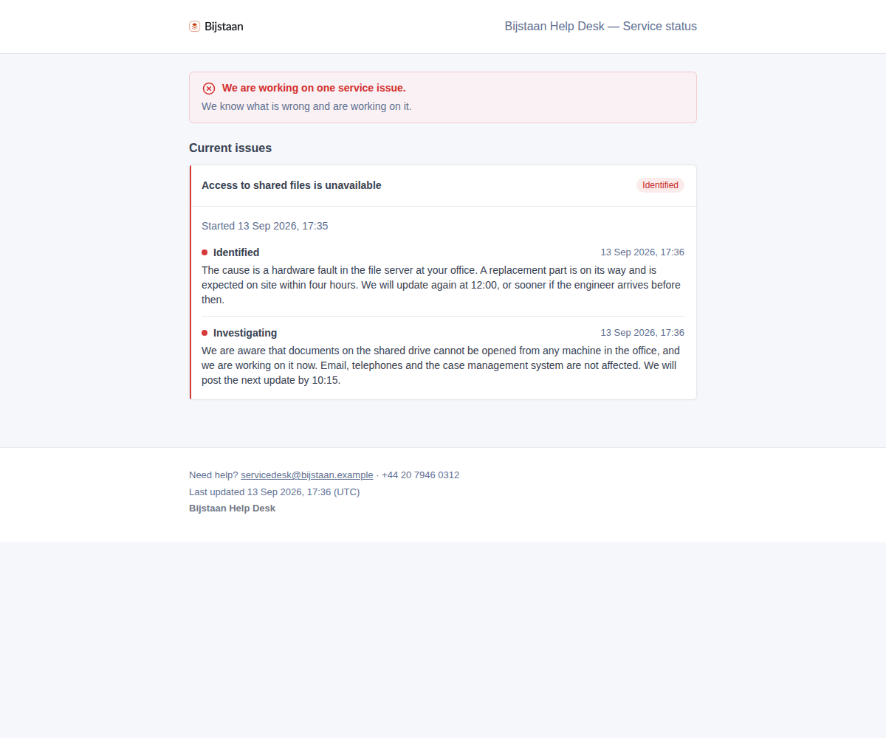

It travels strictly downwards — not to a sibling, not to the parent. That is not
a filter applied afterwards: every query walks sons down from the declaring
entity or ancestors up from the reading entity, and a sibling is in neither list,
so there is no input that produces one. Both suites assert it from both
directions.

The checkbox appears only when the entity has sub-entities, and is off by
default: putting an outage on a page is a publication, and ticking a box costs a
click while taking an outage back off three customers' pages costs an
explanation.

Resolution is unchanged: the outcome is proposed onto **attached** tickets only.

## The optional AI review

With `glpiai` installed, a provider configured and the entity permitted in
glpiai's own settings, the composer offers **Review before publishing** on a
customer-audience update. The model reports jargon a customer would not follow,
detail that should not leave the estate (hostnames, vendors, names, addresses,
speculation stated as fact), and whether the update fails to say what happens
next.

**The model never writes an update and never rewrites one.** Whether a review was
requested, and whether the wording changed afterwards, are both recorded against
the published update.

Under the same guards and the same switch, the post-mortem panel offers **Draft
with AI**: a first draft of the customer-facing post-mortem built from the
incident's own record — the state timeline, the update log, the outcome, and the
internal review's answers where filled — pinned to plain customer-safe prose. The
draft lands in the textarea for a human to edit; publishing is always a human
act, and a published text that originated as a draft says so permanently
(`ai_drafted`, alongside the update log's `ai_reviewed`).

Off by default. When any guard fails, both buttons are absent with the reason
written where the button would be.

## Settings

| Setting | Default | Notes |
|---|---|---|
| Publish status pages | off | Master switch; off, no file is written |
| Page title | empty | Falls back to the branding plugin's product name |
| Timezone | GLPI's | Printed next to the "last updated" stamp |
| Support email / telephone | empty | Shown in the page footer |
| Keep resolved incidents for | 30 days | How far back the history goes |
| Embed the logo under | 256 KB | Over that it is linked instead |
| Republish anything older than | 60 min | The cron backstop, not the normal path |
| Tick "Also covers sub-entities" by default | off | Only offered when the entity has sub-entities |
| Banner on the portal home page | on | Inert until publishing is on and the entity has an address |
| Quiet "Service status" link in the portal | on | Shown whenever that entity has a live address |
| Offer the duplicate banner | on | |
| Match on category / location / wording | on / off / off | At least one stays on |
| Only offer incidents declared within | 72 h | |
| Shortest word that counts as similar | 5 | Without a floor, "the" matches everything |
| Remind the comms owner | on | GLPI notification, to them alone |
| Grace period | 5 min | Nothing is late the instant it is due |
| Remind again after | 30 min | A reminder every cron run gets muted |
| Default next-update interval | 60 min | What the one-click button offers |
| AI review of customer updates | off | Requires glpiai and its entity gate |
| Require an outcome summary to resolve | on | It is also what affected tickets receive |
| Lock a review when complete | on | The lock has a key; unlocking is recorded |
| Attach this procedure on resolution | none | Requires glpisop |
| Offer actions to the improvement register | off | Requires glpiimprove |
| Keep the audit trail for | 730 days | |

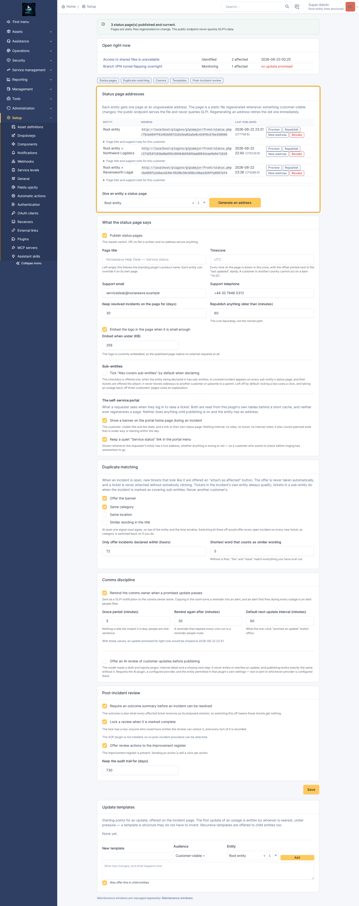

## Rights

- `plugin_glpimajor_declare` — the incident itself. On install, full rights go to
  profiles holding core `config` UPDATE, and **read** to every profile that can
  read a ticket: declaring is deliberate, but seeing that a declaration exists has
  to be universal or the banner is invisible to the people it is for.
- `plugin_glpimajor_config` — settings, templates, status-page addresses,
  maintenance windows. All standard rights rather than read-and-update: a
  maintenance window is an itemtype keyed on this right, and GLPI gates an
  itemtype's new-item form on CREATE — without it the Add button leads to a blank
  page.

## Integration

All optional and guarded. The plugin installs and runs with none of the others
present.

### Maintenance announcements

Another plugin can put a maintenance window on a customer's status page:

```php
$id = \GlpiPlugin\Glpimajor\Maintenance::announce([
    'entities_id'  => 4,                       // required
    'name'         => 'Overnight firewall upgrade',   // required, customer-facing
    'content'      => 'Internet access will drop briefly, twice.',
    'date_start'   => '2026-09-01 22:00:00',
    'date_end'     => '2026-09-02 02:00:00',
    'state'        => 'scheduled',             // scheduled|in_progress|completed|cancelled
    'is_recursive' => 0,                       // 1 = also covers that entity's sub-entities
    'source'       => 'glpichange',            // your plugin key
    'external_key' => 'change:1234',           // your own id for this window
]);
// int on success, false on refusal — Maintenance::lastError() says why.

\GlpiPlugin\Glpimajor\Maintenance::withdraw('glpichange', 'change:1234');
// Marks it cancelled rather than deleting it: a window a customer already
// planned around should visibly go away.
```

`source` + `external_key` make `announce()` an upsert, so a caller re-running its
own sync updates its window rather than littering the customer's page. The
affected entity's page is republished automatically. No session or right is
required, so a cron in another plugin can call it.

Guard with `class_exists(\GlpiPlugin\Glpimajor\Maintenance::class)` to avoid a
hard dependency.

### Post-incident actions → an improvement register

With `glpiimprove` present and the setting on, each PIR action offers a *Send to
improvements* button, calling:

```php
\GlpiPlugin\Glpiimprove\Candidate::fromPlugin(array $payload): int|false
```

```php
[
  'source'       => 'glpimajor',
  'source_key'   => 'piraction:<id>',   // stable, so a re-push is idempotent
  'entities_id'  => int,
  'title'        => string,             // the action, one line
  'description'  => string,             // incident title, what happened, impact, root cause
  'users_id'     => int,                // proposed owner, 0 if none
  'due_date'     => string|null,        // 'Y-m-d'
  'itemtype'     => 'GlpiPlugin\Glpimajor\Incident',
  'items_id'     => int,                // the incident it came from
]
```

Returning the candidate's id records it against the action and stops the same
action being offered twice. Returning `false` is taken as "not accepted", not as
an error. The call is guarded with `class_exists` and `method_exists`.

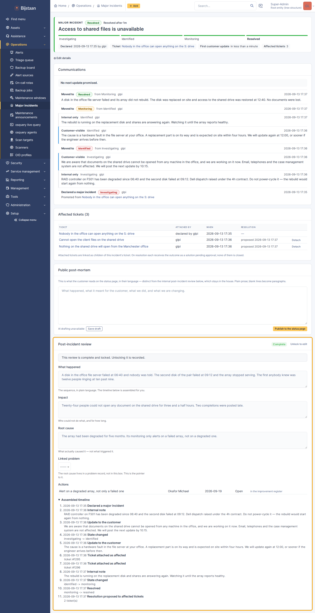

### glpi-sop and glpi-whitelabel

Configure a post-incident-review procedure and it is attached to the incident's
ticket when the incident resolves; if the procedure has been deleted that is
recorded as an event and the resolution carries on. `glpiwhitelabel` is read-only,
for the status page's branding.

## Limitations

- **One brand, not one per customer.** glpiwhitelabel is instance-wide, so every
  status page wears the MSP's identity. Per-entity you get a page title, a
  support note and the support contact.
- **The status page is English.** Its strings are not translated: it is one
  document served to whoever holds the address, with no session to read a
  language preference from. The technician-facing side is fully translatable.
- **Regeneration is synchronous.** Publishing an update writes a file on that
  request. A failure is recorded on the page row and shown on the settings page
  rather than thrown at the technician.
- **`affected_count` is a cache.** The `affected` rows are the truth; the column
  exists so the incident list can sort on it, and it is recomputed on every attach
  and detach.
- **Coverage is downwards only, with no way to ask for anything else.** If two
  customers share a real dependency, that is two declarations, deliberately.
- **Republishing a covering change costs one render per published page in the
  subtree, on the request that made the change.** Three offices is three small
  files. A customer with forty sub-entities that have all been given addresses is
  forty renders on that request. The query only finds pages that exist, so the
  cost tracks addresses somebody minted rather than branches in the tree.
- **The portal reads a cache** — sixty seconds per entity, dropped whenever that
  entity's page is republished. Anything changing what the banner should say
  without republishing a page can be up to a minute late there. The published
  page itself is never stale.
- **The portal banner says "ticket".** The status page uses none of GLPI's
  vocabulary and the suite scans it word by word; the portal is inside GLPI's own
  helpdesk, whose navigation says "Tickets" two inches above the banner. Roles,
  internal notes and the ticket's own title are still absent, and asserted so.
- **No detection.** Nothing declares an incident by itself and nothing attaches a
  ticket by itself. Both are always a person.
- **The duplicate link is `SON_OF`, not `DUPLICATE_WITH`.** Core treats a
  duplicate link as an instruction — solving the parent copies the solution into
  every duplicate and pushes a status change onto them, which is auto-closing by
  another name. `SON_OF` carries no propagation.
- **Detaching leaves the core link.** Somebody may have explained it in a
  followup, and silently unpicking a relationship a technician can see is worse
  than leaving a stale one they can remove.
- **Audit rows outlive their incident.** Purging an incident drops its updates,
  attachments and review, but not its audit trail.

## Tests

```bash
docker compose -p glpi exec glpi sh -c 'cd /var/www/glpi/plugins/glpimajor && tests/run.sh'
```

`matching.php` covers duplicate matching, `feed.php` the update log and its
audiences, `nag.php` the next-update reminder arithmetic, and `statuspage.php`
the renderer — including the word-by-word scan that keeps GLPI's vocabulary off a
customer-facing page, and the redaction checks that run over both the published
file and the in-portal view.

`db-live.php` needs an active install and writes to it. `tests/browser/` covers
the cockpit, the composer, the duplicate banner and the portal surfaces.

## Licence

GPL-3.0-or-later, the same licence as GLPI. The plugin is loaded into GLPI's
process and extends its classes, so it is a derivative work. See
[LICENSE](LICENSE).
